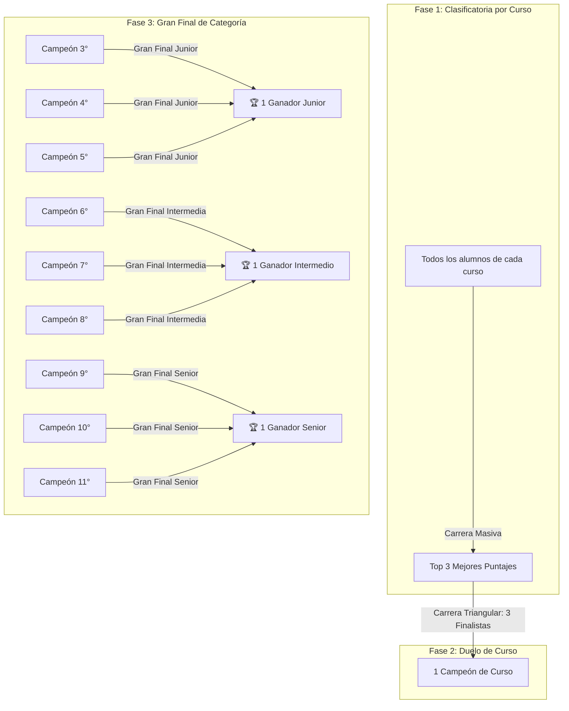

# 🦖 Propuesta Oficial: Torneo Intercolegial "Dino Runner Challenge"
## *Copa de Agilidad, Reflejos y Concentración Escolar*

---

## 1. 🎯 Objetivos del Concurso

1. **Desarrollo de habilidades cognitivas:** Estimular la concentración sostenida, la toma de decisiones bajo presión y los reflejos psicomotrices en los estudiantes.
2. **Integración y sana convivencia escolar:** Crear un espacio lúdico y formativo que fomente el espíritu de superación, el compañerismo y el respeto en la competencia.
3. **Apropiación tecnológica:** Utilizar la plataforma multijugador centralizada en tiempo real, demostrando el uso educativo y de gamificación de la tecnología en el colegio.

---

## 2. 👥 Estructura de Categorías

El torneo se divide en **3 categorías formativas** para garantizar la equidad y nivel de habilidad acorde a la etapa escolar:

| Categoría | Grados Escolares | Enfoque y Nivel |
| :--- | :--- | :--- |
| **🟢 Categoría Junior** | **3°, 4° y 5°** (Primaria) | Coordinación visomotora, entusiasmo y primeros reflejos. |
| **🔵 Categoría Intermedia** | **6°, 7° y 8°** (Secundaria Básica) | Velocidad de reacción, precisión y resistencia. |
| **🟣 Categoría Senior** | **9°, 10° y 11°** (Secundaria Media / Alta) | Alta exigencia, reflejos avanzados y consistencia en alta velocidad. |

> 🏆 **Resultado final:** Habrá **1 solo Gran Campeón por cada Categoría** (3 Campeones Institucionales en total).

---

## 3. ⚔️ Dinámica del Torneo en 3 Fases

---

### 📌 Fase 1: Clasificatoria Intragrado (General por Cursos)
* **¿Quiénes participan?** Todos los estudiantes de un curso individual (ejemplo: todo 3°A, luego todo 3°B, todo 4°A, etc.).
* **Mecánica:**
  1. Los estudiantes ingresan desde la sala de informática, tablets o sus celulares a la sala con el PIN proyectado en pantalla gigante.
  2. Todos inician simultáneamente al sonido de la cuenta regresiva oficial (3, 2, 1).
  3. Todos los jugadores enfrentan **la misma secuencia determinística de cactus y aves** gracias a la semilla sincronizada.
* **Criterio de clasificación:** Los **3 estudiantes con mayor puntaje** de ese curso se convierten en los **Finalistas del Curso**.

---

### 📌 Fase 2: Duelo de Campeón de Curso (Fase Triangular)
* **¿Quiénes participan?** Únicamente los **3 finalistas** obtenidos en la Fase 1 de cada curso.
* **Mecánica:**
  1. Los 3 finalistas compiten en una carrera exclusiva frente al salón o en el auditorio.
  2. Los demás compañeros apoyan como espectadores siguiendo las posiciones en vivo en la pantalla gigante.
* **Criterio de clasificación:** **Solo 1 estudiante** (el primer lugar del podio de esa carrera) se corona como **Campeón del Curso** y obtiene el cupo directo a la Gran Final de su categoría.

---

### 📌 Fase 3: Gran Final de Categoría (La Batalla de Campeones)
* **¿Quiénes participan?** Los campeones de cada curso perteneciente a la categoría:
  * **Final Junior:** Campeón de 3° vs. Campeón de 4° vs. Campeón de 5° *(o los representantes de cada sección si hay varios paralelos)*.
  * **Final Intermedia:** Campeón de 6° vs. Campeón de 7° vs. Campeón de 8°.
  * **Final Senior:** Campeón de 9° vs. Campeón de 10° vs. Campeón de 11°.
* **Mecánica:**
  1. Carrera estelar en el proyector principal ante toda la comunidad educativa / auditorio.
  2. Partida única de máxima concentración donde la velocidad y los obstáculos pondrán a prueba a los mejores.
* **Ganador:** El jugador con la mayor puntuación de la carrera se consagra como el **Gran Campeón Institucional de su Categoría**.

---

## 4. ⚖️ Reglas Oficiales y Criterios de Desempate

1. **Igualdad de Condiciones Absoluta:**
   - La plataforma genera una **semilla matemática compartida (`race_seed`)**, garantizando que cada participante enfrente exactamente la misma distancia, tamaño y distribución de obstáculos al mismo tiempo.
2. **Transparencia en el Arbitraje:**
   - El sistema monitorea en tiempo real las posiciones, la velocidad y la distancia de cada corredor, evitando cualquier intento de alteración o trampa.
3. **Criterios de Desempate Automatizados por el Sistema:**
   Si dos o más jugadores alcanzan puntajes cercanos, el sistema desempata estrictamente en este orden:
   1. **Mayor Puntaje Total** (`score`).
   2. **Mayor Distancia Recorrida** en píxeles (`distance`).
   3. **Supervivencia:** El jugador activo (*sobreviviente*) siempre clasifica por encima de uno que ya haya chocado (*crashed*).
   4. **Tiempo de Supervivencia:** Quien resistió más segundos antes de colisionar.
   5. **Orden de Llegada:** Momento exacto del choque en milisegundos.

---

## 5. 💻 Configuración Técnica en el Sistema "Dino Tournament"

Para la ejecución impecable del torneo, se utiliza la infraestructura ya integrada en la plataforma:

### 📺 Pantalla Central (Proyector / Auditorio / TV)
- **URL Anfitrión:** `http://localhost:3000/admin` (o `https://juegodino.pages.dev/admin`) con la clave de anfitrión (`dino2026`).
- **Vista en Vivo:** Muestra el código PIN gigante en el lobby, la cuadrícula multijugador con los dinosaurios corriendo en tiempo real, el mapa de radar de avance y la lluvia de confeti al concluir cada carrera.
- **Nomenclatura recomendada en el panel:**
  - **Evento:** *Torneo Dino Escolar 2026*
  - **Nombre de Partida:**
    - Fase 1: `Clasificatoria - Grado 5°A`
    - Fase 2: `Duelo de Curso - Final 5°A`
    - Fase 3: `Gran Final - Categoría Junior (3°-5°)`

### 📱 Dispositivos de los Estudiantes
- **URL Jugadores:** `http://<IP-LOCAL>:3000/player` (o `https://juegodino.pages.dev/player`).
- **Experiencia del alumno:** Ingreso ágil mediante PIN, selector de color personalizado, controles táctiles y de teclado (barra espaciadora / flecha abajo), vista de ranking personal en tiempo real (`1º`, `2º`, `3º`) y notificaciones al adelantar o ser adelantado.

### 📊 Auditoría y Exportación de Resultados
- Al finalizar cada ronda, el anfitrión puede hacer clic en **"📥 Exportar CSV"** o **"🖨️ Imprimir Reporte"** para guardar el acta oficial con nombres, posiciones, puntajes y tiempos exactos.

---

## 6. 📅 Cronograma Sugerido de Ejecución

El torneo puede desarrollarse en una **Jornada Especial (Día de la Ciencia / Tecnología / Deporte)** o distribuido a lo largo de una semana:

| Horario / Bloque | Actividad | Detalle |
| :--- | :--- | :--- |
| **08:00 - 08:30** | Apertura y Explicación | Presentación del torneo en el proyector y prueba de calentamiento. |
| **08:30 - 10:00** | **Fase 1: Clasificatorias Junior** | Rondas individuales de 3°, 4° y 5°. Salen 3 finalistas por curso. |
| **10:00 - 10:30** | **Fase 2: Duelos de Curso Junior** | Carreras triangulares. Sale 1 representante por curso. |
| **10:30 - 11:00** | Receso pedagógico | Descanso y preparación de la siguiente categoría. |
| **11:00 - 12:30** | **Fase 1: Clasificatorias Intermedia** | Rondas individuales de 6°, 7° y 8°. Salen 3 finalistas por curso. |
| **12:30 - 13:00** | **Fase 2: Duelos de Curso Intermedia** | Carreras triangulares. Sale 1 representante por curso. |
| **13:00 - 14:00** | Almuerzo / Descanso | |
| **14:00 - 15:30** | **Fase 1: Clasificatorias Senior** | Rondas individuales de 9°, 10° y 11°. Salen 3 finalistas por curso. |
| **15:30 - 16:00** | **Fase 2: Duelos de Curso Senior** | Carreras triangulares. Sale 1 representante por curso. |
| **16:00 - 16:45** | 🏆 **FASE 3: GRANDES FINALES** | Las 3 Grandes Finales consecutivas proyectadas en auditorio. |
| **16:45 - 17:15** | Ceremonia de Premiación | Entrega de trofeos y diplomas a los 3 Campeones Institucionales. |

---

## 7. 🎁 Premiación y Reconocimientos Sugeridos

* 🥇 **Gran Campeón Junior (3°-5°):** Trofeo *"Dino de Oro Junior"* + Diploma de Honor + Premio sorpresa.
* 🥇 **Gran Campeón Intermedio (6°-8°):** Trofeo *"Dino de Oro Intermedio"* + Diploma de Honor + Premio sorpresa.
* 🥇 **Gran Campeón Senior (9°-11°):** Trofeo *"Dino de Oro Senior"* + Diploma de Honor + Premio sorpresa.
* 🥈 **Subcampeones de Categoría (2° y 3° lugar):** Medallas de Plata y Bronce + Mención de Excelencia.
* 🎖️ **Campeones de Curso (Fase 2):** Diploma de *"Campeón de Aula / Curso"*.
* 📜 **Participantes:** Certificado digital de participación para todos los alumnos.

---

## 8. ✅ Checklist Operativo para los Docentes y Organizadores

- [ ] Verificar conexión a la red local (WiFi o cable de red) en la sala de sistemas o auditorio.
- [ ] Conectar la computadora principal al proyector/pantalla y abrir `/admin` en pantalla completa (`F11`).
- [ ] Disponer de los equipos para los estudiantes (computadores o tablets con navegador web actualizado).
- [ ] Realizar una carrera de práctica de 1 minuto antes de la primera ronda oficial.
- [ ] Nombrar claramente cada partida en el panel de control antes de presionar *"Iniciar Partida"*.
- [ ] Descargar el archivo CSV al final de cada etapa para respaldo de puntuaciones.
